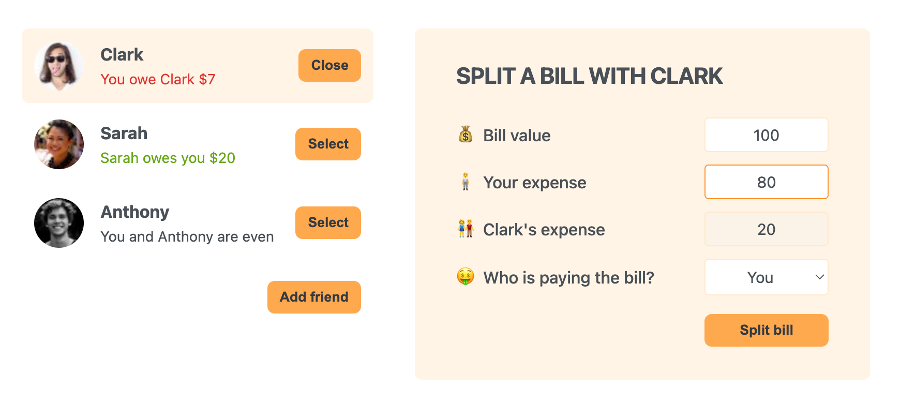

# Eat-N-Split

**Eat-N-Split** is a simple one-page application built with React that helps you manage shared expenses with your friends. Whether you need to split a bill after dining out or keep track of who owes whom, this app has got you covered.



## Features

- **Add and Manage Friends**: Easily add friends with names and profile pictures.
- **Track Balances**: View how much each friend owes or is owed.
- **Split Bills**: Enter the total bill and assign how much each person paid. The app will automatically calculate who owes what.

## Installation and Setup

To get started, clone the repository and run the following commands in your terminal:

```bash
# Install the project dependencies
>npm install

# Start the development server
>npm start
```

This will start the app locally on http://localhost:3000/.

## How to Use

**1.Adding Friends:** Click the "Add Friend" button and fill out the form to add new friends to the list.
**2.Selecting a Friend:** Click "Select" next to a friend's name to manage their balance.
**3.Splitting a Bill:** When a friend is selected, the form to split the bill will appear. Enter the total bill amount, how much you paid, and the app will calculate how much your friend owes (or how much you owe them).
**4.Balance Management:** View your friends' balances directly in the app. Positive numbers mean your friend owes you; negative numbers mean you owe your friend.

## Example Usage

1.Add Clark, Sarah, and Anthony (who come with default avatars).
2.Select a friend, input the bill amount and your paid share. 3. Automatically calculate the difference and update the balance.

## Technologies Used

**React** for building the UI.
**CSS** for styling.
**JavaScript** for the core logic of adding friends, managing selections, and handling bill splitting.
